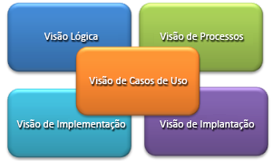
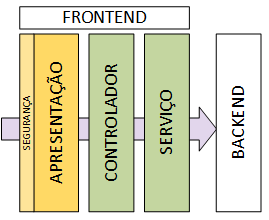
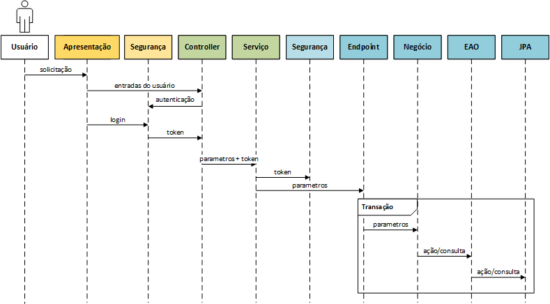
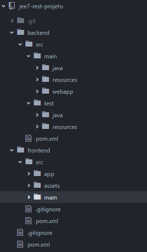
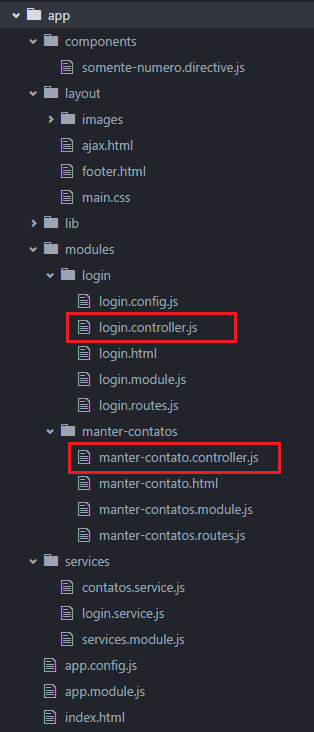
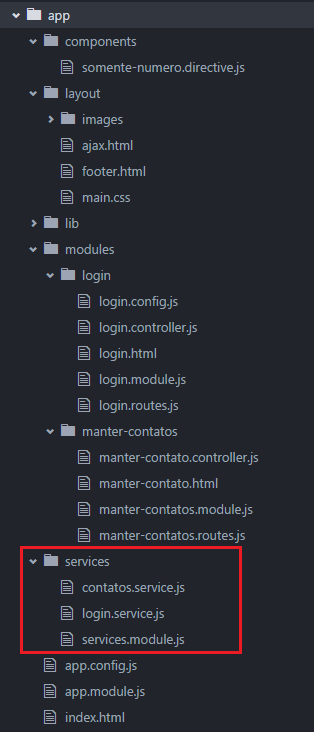
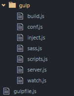
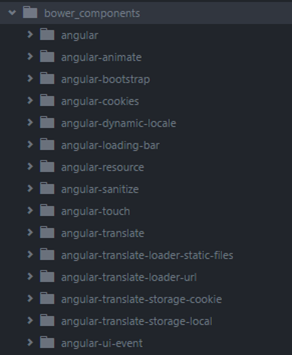

# ARQUITETURA DE REFERÊNCIA FRONTEND

# INTRODUÇÃO

## Finalidade

Este documento apresenta um conjunto de padrões e considerações técnicas importantes organizados através de visões com enfoque em cada aspecto da construção dos sistemas dentro desta instituição, fornecendo uma descrição da arquitetura do projeto, mostrando e exemplificando a solução arquitetural utilizada para atender os requisitos funcionais e não funcionais do sistema.

## Escopo

De acordo com as definições organizacionais, os sistemas deverão ser construídos utilizando as tecnologias AngularJS e Java EE7.

Este documento apresenta as características da arquitetura de referência apenas para o desenvolvimento do **frontend** a ser construído em AngularJS.

A arquitetura é apresentada através de um conjunto de visões que, juntas, cobrem os principais aspectos técnicos relativos ao desenvolvimento e implantação do software, são abordados assuntos como a separação em camadas, linguagens e plataformas de desenvolvimento (hardware e software), servidores de aplicação, de banco de dados, frameworks e APIs.
É também escopo deste documento orientar todo o pessoal técnico envolvido nas equipes de desenvolvimento.

## Definições, Acrônimos e Abreviações

| Termo | Descrição |
| --- | --- |
| AngularJS | AngularJS é um framework JavaScript open-source, mantido pelo Google, que auxilia na execução de single-page applications. Seu objetivo é aumentar aplicativos que podem ser acessados por um navegador web, sob o padrão model–view–controller (MVC), em um esforço para facilitar tanto o desenvolvimento quanto o teste dos aplicativos. |
| Bootstrap | É um framework Javascript e CSS originado no Twitter que torna o desenvolvimento das interfaces com o usuário (front-end) mais rico, rápido e fácil. Ele é feito pensado em pessoas de todos os níveis, dispositivos de todas as formas e os projetos de todos os tamanhos escalando de forma eficiente seus sites e aplicativos com uma única base de código, desde de telefones até tablets e desktops. |
| CDI | É o padrão definido para a linguagem Java relativo à injeção de dependências e interceptação que são a base de vários outros frameworks e futuras especificações. |
| CSS3 | O CSS3 é a mais nova versão das famosas Cascading Style Sheets (ou simplesmente CSS), é uma linguagem de definição visual com a declaração de estilos para páginas web com efeitos de transição, imagem, e outros, que dão um estilo novo às páginas Web 2.0 em todos os aspectos visuais e de layout. |
| EJB | É o padrão definido para a plataforma Java que define a criação de aplicações distribuídas baseadas em componentes escaláveis, transacionais e seguros. Os EJBs conterão a implementação das regras e lógica negociais do sistema. |
| ENDPOINT | Ponto de entrada dos serviços REST. Responsável por receber as requisições dos serviços. |
| HIBERNATE | É um framework para o mapeamento objeto-relacional escrito na linguagem Java. O objetivo do Hibernate é diminuir a complexidade entre os programas Java orientados a objetos e os bancos de dados ditos modelo relacionais, em especial, no desenvolvimento de consultas e atualizações dos dados. Sua principal característica é a transformação das classes em Java para tabelas de dados e dos tipos de dados Java para os da SQL. O Hibernate gera as consultas SQL e libera o desenvolvedor do trabalho manual da conversão dos dados resultantes, mantendo o programa portável para quaisquer bancos de dados. |
| HTML5 | O HTML5 é a versão mais recente de uma linguagem utilizada para definição de páginas na internet. Essa versão trouxe importantes mudanças quanto ao papel do HTML no mundo web, através de novas funcionalidades como semântica, acessibilidade e a possibilidade do uso de novos recursos. Sua essência tem sido melhorar a linguagem com o suporte para as mais recentes mídias, enquanto a mantém facilmente legível por seres humanos e consistentemente compreendida por computadores e outros dispositivos (navegadores, tablets, smartphones, etc). |
| JAX-RS | É o padrão definido para a plataforma Java que descreve a construção de serviços RESTful. |
| JPA | É o padrão definido para a linguagem Java que descreve uma interface comum para frameworks de persistência de dados. A JPA define um meio de mapeamento objeto-relacional para objetos Java simples e comuns (POJOs), denominados beans de entidade. |
| KEYCLOAK | Solução integrada de autorização e autenticação com características “single sign on” para navegadores e serviços REST. Construída baseada nas especificações OAuth 2.0, Open ID Connect, JSON Web Token (JWT) e SAML 2.0. |
| RAML | Padrão textual aberto para documentação de serviços REST. |
| RESTEASY | É a implementação da JBoss para especificação JAX-RS que provê bibliotecas que facilitam o desenvolvimento de serviços RESTful. |

## Referências

* AngularJs - https://angularjs.org/
* Angular styleguide - https://github.com/johnpapa/angular-styleguide/blob/master/a1/i18n/pt-BR.md
* Bootstrap - http://getbootstrap.com/
* Design Patterns - http://www.oracle.com/technetwork/java/index-138725.html
* Java Platform Enterprise Edition 7
* Java Persistence 2.1 (JSR 338)
* Enterprise JavaBeans 3.2 (JSR 345)
* https://httpstatuses.com/
* http://racksburg.com/choosing-an-http-status-code/
* Concurrency Utilities for Java EE 1.0 (JSR 236)
* JAX-RS: The Java API for RESTful Web Services 2.0 (JSR 339)
* Java Servlet 3.1 (JSR 340)
* Contexts and Dependency Injection for Java EE 1.1 (JSR 346)
* Bean Validation 1.1 (JSR 349)
* Batch Applications for the Java Platform 1.0 (JSR 352)
* Java API for JSON Processing 1.0 (JSR 353)
* Web Services for Java EE 1.4 (JSR 109)
* Java Authorization Service Provider Contract for Containers 1.5 (JACC 1.5) (JSR 115)
* Common Annotations for the Java Platform 1.2 (JSR 250)
* Interceptors 1.2 (JSR 318)
* Java EE Connector Architecture 1.7 (JSR 322)
* Java Transaction API 1.2 (JSR 907)

# REPRESENTAÇÃO ARQUITETURAL

As arquiteturas de referência podem existir ou serem usadas em diferentes níveis de abstração e a partir de diversos pontos de vista. Esses pontos de vista, ou aspectos, são demonstrados através de um padrão conhecido como “Visões 4+1”. Desse modo, o arquiteto de software pode selecionar a visão que seja mais adequada, por exemplo: apenas um design de arquitetura ou um design e uma implementação, em variados graus de conclusão.



**Figura 1 - As Visões Arquiteturais**

## Metas e Restrições da Arquitetura

A meta da arquitetura é suportar os requisitos funcionais ou de negócio, e os requisitos não funcionais da aplicação como: Manutenibilidade, Interoperabilidade, Portabilidade, Reusabilidade, Confiabilidade, Integridade e Segurança.

A arquitetura definida é baseada em diversos padrões para permitir uma abordagem corporativa para o desenvolvimento de software em larga escala, através da implementação de componentes de negócio, serviços, e componentes de interface gráfica reutilizáveis de forma desacoplada viabilizando a produtividade e padronização no desenvolvimento.

Esse documento descreve a arquitetura para aplicações web, ou seja, que operem através de um navegador como o Firefox, Chrome ou Internet Explorer.

As seguintes restrições foram levadas em consideração para a definição da arquitetura:

| Categoria | Descrição |
| --- | --- |
| Navegadores Suportados | **Internet Explorer** (versões 10 ou superior), **Microsoft EDGE** (versões 25 ou superior),  **Mozilla Firefox** (versões 40 ou superior), **Google Chrome** (versões 40 ou superior) |
| Linguagens e Frameworks | **AngularJS** (versão 1.5.x), **Java** (versão 8), **JEE** (versão 7), **Hibernate** (versão 5.x), **Keycloak** (versão 2.0.1) |
| Servidor de Aplicação | Wildfly, versão 10 |
| Servidor de Banco de Dados | Oracle e PostgreSQL (compatível com qualquer banco de dados suportado pelo provider de persistência). |
| Segurança (Req. Não Funcional) | Deverá ser utilizado uma solução SSO / OAuth 2 |
| Auditoria de Código | Sonarqube, versão 5.3 |
| Desempenho (Req. Não Funcional) | Nenhum definido até o momento |
| Confiabilidade (Req. Não Funcional) | Nenhum definido até o momento |
| Rastreabilidade (Req. Não Funcional) | Nenhum definido até o momento |
| Acessibilidade (Req. Não Funcional) | Nenhum definido até o momento |

# VISÃO DE CASOS DE USO

Este documento limita-se a definir a arquitetura tecnológica do sistema, sem qualquer alusão a casos de uso previamente definidos. Qualquer necessidade de solução técnica para os casos de uso do sistema será introduzida nos documentos de arquitetura específico de cada projeto.

# VISÃO LÓGICA

## Definição das Camadas

Neste tópico é abordada a definição das camadas do software e as tecnologias implementadas em cada uma. A “divisão de responsabilidades”, um dos pilares da orientação a objetos, foi a base da arquitetura aqui proposta. A utilização de serviços negociais e a clara separação entre a apresentação e o negócio da aplicação garantem um baixo acoplamento entre as camadas e possibilidade de reaproveitamento das regras negociais do projeto.



**Figura 2 - Relacionamento entre Camadas**

Fazendo um paralelo com o padrão de projeto Model/View/Controller – MVC, as camadas VIEW e CONTROLLER serão tratadas neste documento, enquanto a camada MODEL, que é de responsabilidade da estrutura **BACKEND**, será descrita em documento específico.

### APRESENTAÇÃO (MVC - VIEW)

A camada VIEW é chamada GUI (Graphical User Interface), frontend ou interface com o usuário. É responsável pela interação entre os usuários e o sistema e é representada na imagem pela cor laranja.

Através dessa camada os usuários submetes pedidos ao sistema e recebem os seus respostas. Por exemplo:

* Um pedido de relatório ou de consulta a alguma informação do banco de dados;
* O pedido de gravação de algum registro no banco de dados.

Elementos como componentes visuais, mensagens ao usuário, retorno das solicitações são construídos nessa camada, bem como: páginas HTML, imagens, arquivos estáticos, arquivos de estilo CSS e scripts/frameworks Javascript que permitem a criação de uma interface gráfica rica e funcional.

Tecnologias utilizadas nessa camada: **AngularJS, Keycloak, HTML5, CSS3 e Bootstrap**.

#### SEGURANÇA

Por questões didáticas, foi incluída uma "subcamada" chamada SEGURANÇA representando a existência de um controle de autenticação e autorização com a administração dos níveis de acesso dos usuários baseados em perfis e permissões.

### CONTROLADORES (MVC - CONTROLLER)

Responsável pela intermediação das solicitações oriundas da camada VIEW e o backend. Outras funções dessa camada:

* Controle das funções da interface;
* Validação das informações inseridas pelos usuários;
* A preparação dos insumos necessários para a próxima camada.

Tecnologias utilizadas nessa camada: **AngularJS, Restangular, Keycloak**.

Com um propósito didático, essa camada foi separada em duas "subcamadas":

#### CONTROLADOR

Responsável pela validação e manipulação das informações e da interface. Não deve haver lógica negocial nessa camada, apenas lógica de interface como: apresentação de botões, listas de seleção e campos de entrada de dados.

#### SERVIÇO

Sua função é manter um repositório único de componentes de acesso aos serviços da aplicação, ou seja, nessa subcamada é mantida uma representação em Javascript para cada endpoint e serviço existente no backend.

# VISÃO DE PROCESSOS

Aqui é descrito o funcionamento da arquitetura e como seus componentes interagem entre si. Os tópicos a seguir irão demonstrar, em linhas gerais, o fluxo de informações definido nesse documento.

## Fluxo Padrão



**Figura 3 - Processo padrão de consumo de um recurso publicado**

Um conteúdo disponível na internet é processado da seguinte maneira:

* A solicitação é feita na camada APRESENTAÇÃO;
* Uma verificação de segurança é efetuada, se necessário, a identificação do usuário é solicitada.
* Uma vez autenticado e autorizado o usuário, sua requisição continua.
* Os controladores fazem uma verificação inicial, garantindo que as informações coletadas da apresentação são suficientes para a próxima camada;
* O controlador da funcionalidade faz uma chamada a um serviço REST através de sua fachada (SERVIÇO) encaminhando as informações coletadas;
* Uma nova verificação de segurança é feita utilizando a chave de acesso do usuário já autenticado anteriormente;
* O componente “Endpoint” inicia a transação da requisição (quando necessária);
* A implementação do negócio é chamada, as regras de negócio validadas, pode ser necessário a chamada de outros serviços para garantir o correto funcionamento do processo de negócio e a resposta da requisição é preparada;
* A transação é confirmada;
* A resposta é então retornada através das camadas até o controlador que prepara o retorno para apresentação ao usuário.

# VISÃO DE IMPLANTAÇÃO

A visão de implantação fornece uma base que permitirá compreender a distribuição física do sistema em um conjunto de nós de processamento, incluindo a distribuição física e threads. Esse é um documento de referência arquitetural e não será abordado tópicos como distribuição em servidores ou topologia de rede.

## Publicação do Projeto

Esse tópico será tratado nos documentos de arquitetura específicos de cada projeto.

# VISÃO DA IMPLEMENTAÇÃO

A finalidade da visão de implementação é descrever as decisões de arquitetura tomadas para p desenvolvimento. Normalmente, a visão de implementação é útil para atribuir o trabalho de implementação a indivíduos e equipes ou a subcontratantes, avaliar a quantidade de código que será desenvolvida, modificada ou excluída, a reutilização em larga escala e considerar as estratégias de release.

## Estrutura da Aplicação

Considerando que o frontend pode ser publicado em um nó de rede diferente do backend, eles serão desenvolvidos em projetos independentes.

### Estrutura do Frontend

O frontend, apesar de distribuído dentro de um arquivo WAR, é, basicamente, um projeto Javascript/NodeJS que faz uso das ferramentas Bower e Gulp.

Dentro de **frontend/src/app** encontram-se os arquivos fontes do projeto. Após a execução do “build”, o pacote de distribuição será gravado na pasta **src/main/webapp** para empacotamento pelo Maven e publicação no servidor de aplicações.

A camada APRESENTAÇÃO é composta pelos seguintes artefatos: HTML, CSS, imagens e diretivas (directives) contidos nas páginas, e são utilizados para criar elementos HTML personalizados e simplificar a manipulação do DOM.

A figura a seguir exibe os diretórios e arquivos da camada APRESENTAÇÃO específicos para a criação de diretivas*,* de CSS e de imagens, bem como o diretório específico das funcionalidades *login* e *manter-contatos*.



**Figura 5 - Estrutura da Camada APRESENTAÇÃO**

Onde:

* components – identificado pelo número 1 na figura – é o local para os componentes e diretivas criadas específicas para o projeto.
* layout – identificado pelo número 2 na figura – é o local onde ficam todos os arquivos relacionados à identidade visual do projeto, tais como, CSS, imagens, templates globais que podem ser utilizados em todo o projeto.
* modules – identificado pelo número 3 na figura – essa pasta é subdividida de acordo com as funcionalidades do projeto. Cada subpasta tem o nome da funcionalidade, representado pelas pastas login e manter contatos. Nelas estão os arquivos responsáveis pelo funcionamento de cada funcionalidade. No caso da camada de APRESENTAÇÃO, estão os arquivos HTML, como pode ser visto no número 4 na figura.

O AngularJS, por meio de um objeto denominado “escopo”, núcleo de qualquer aplicação construída nesse framework, possui as seguintes características:

* Fornece observers que verificam mudanças no modelo, através da função “$watch()”;
* Fornece a capacidade de propagar as mudanças do modelo, por toda a aplicação e por todos os seus componentes (controllers, services, event handlers) por meio da função “$apply()”;
* Fornece o isolamento de funcionalidades e propriedades por escopo, devido à possibilidade de serem criados de forma aninhada, ou seja, um escopo filho herda propriedades do escopo pai;
* Fornece contexto que possibilita a avaliação de expressões. Por exemplo: ao declararmos a expressão {{nome}} em uma página HTML, esta expressão só terá sentido se estiver definida dentro do escopo.

Assim, o escopo é o modelo de dados utilizado pelo AngularJS, que além das características listadas acima, possui a responsabilidade de guardar, tratar e manipular os dados nele contidos.

Este objeto faz a ligação entre a camada APRESENTAÇÃO e a camada CONTROLADOR, tendo em vista que todas as propriedades e funções são automaticamente acessíveis nas páginas do sistema.

A camada CONTROLADOR tem como principal função adicionar funções e comportamentos ao escopo definido na camada anterior aumentando as possibilidades fornecidas pela camada APRESENTAÇÃO. Além disso, os controladores são utilizados para definir um estado inicial para o objeto escopo.

Cada módulo, ou funcionalidade da aplicação, possui apenas um controlador, caso haja a necessidade de ter mais de um, deve-se criar um novo módulo. Isso facilita a manutenção, evita módulos com muitos arquivos e controladores muito extensos. A figura a seguir mostra a localização dos controladores:



**Figura 6 - Localização dos Controladores**

A camada SERVIÇO permite o tráfego de dados entre controladores de forma consistente, por meio de injeção de dependência. Esta característica existe porque, diferentemente dos controladores, os serviços são objetos de instância única conhecidos por Singletons. Os serviços também possuem um caráter lazy-loaded*,* ou seja, são criados apenas quando necessários.

A camada de serviços tem como principal função realizar a integração com os recursos disponíveis no backend, por meio de requisições via protocolo HTTP e JSON, em linhas gerais, é a fachada dos serviços da API construídos em Javascript.

Os serviços não são armazenados nos módulos das funcionalidades, já que, pode ser reaproveitado e invocado em mais de uma funcionalidade. Dessa forma, eles possuem uma localização específica:



**Figura 7 - Localização dos Serviços**

### Gulp

O Gulp é uma ferramenta que automatiza tarefas repetitivas, mas essenciais para o desenvolvimento frontend, tais como: concatenação de arquivos, minificação, compilação de SASS, testes e muitas outras necessárias para a geração de um build rápido e eficiente. Outro benefício é o LiveReload, onde um servidor web é iniciado, então todos os arquivos ficam sendo observados. No momento que uma alteração é salva, o navegador é automaticamente atualizado. O Gulp é uma ferramenta que utiliza os recursos do Node.js, por isso é necessário que o Node.js esteja instalado no ambiente local. Abaixo a pasta onde podem ser encontrados os arquivos de configuração das tarefas.



**Figura 8 - Tarefas do Gulp**

-   *gulpfile.js* – arquivo principal, carrega todas as tarefas.

-   *build.js* – arquivo responsável pelo processo de build, executar as tarefas de minificação, concatenação, otimização.

-   *config.js* – responsável pelas variáveis de configuração para os outros arquivos.

-   *inject.js* – responsável por localizar no projeto todos os arquivos javascript, CSS, e injetar a importação no index.html.

-   *sass.js* – responsável pela compilação dos arquivos SASS e transformar em arquivos CSS.

-   *scripts.js* – responsável pela otimização dos arquivos javascript.

-   *server.js* – responsável pela tarefa de LiveReload e iniciar o servidor web.

-   *watch.js* – responsável por observar as alterações nos arquivos.

Para executar uma tarefa, basta entrar na pasta raiz do projeto e executar o comando abaixo no prompt.

Parar iniciar o servidor web e o LiveReload:

```
gulp serve
```

Para iniciar o processo de build:

```
gulp build
```

### Bower

O Bower é uma ferramenta de gerenciamento das dependências do frontend e também utiliza recursos do Node.js. Com ela, as bibliotecas são facilmente instaladas e atualizadas. Abaixo a pasta onde as bibliotecas vão sendo instaladas.



**Figura 9 - Pasta de bibliotecas instaladas pelo Bower**

O arquivo bower.json registra o nome e a versão da biblioteca instalada no projeto. O arquivo é automaticamente atualizado executando o comando bower install --save.

Para instalar uma nova biblioteca basta entrar na pasta raiz do projeto e executar o comando abaixo:

```
bower install <nome-biblioteca> --save
```

Para atualizar as bibliotecas:

```
bower update
```
## Pacotes e Nomenclaturas

### Frontend

Todos os pacotes abaixo abaixo estão hierarquicamente abaixo de: frontend/src/app

| Pacotes | Descrição | Padrão de Nomenclatura |
| --- | --- |  --- |
| Module | Corresponde a uma funcionalidade do sistema. | [função].module.js |
| Controller | Responsáveis pelo controle e manipulação da interface além das chamada dos serviços do backend. | [função].controller.js |
| Rotas | Determinam as saídas e urls da funcionalidade | [função].routes.js |
| Directive | Templates e componentes visuais específicos do sistema | [função].directive.js |
| Service | Responsáveis pela comunicação com o backend. | [função].service.js |

## Padrões de desenvolvimento

### Expressão IIFE

Os arquivos javascript do projeto (modules, service, controllers, routes e directives) devem ser envolvidos por uma *Immediately Invoked Function Expression*, ou IIFE (Expressão de função imediatamente invocada). Uma IIFE remove as variáveis do escopo global. Isso ajuda a prevenir declarações de variáveis e funções de viverem por mais tempo que o esperado no escopo global, que também auxilia evitar colisões de variáveis. Ela também deixa o código seguro para o processo de minificação. Exemplos:

```
(function() {
	'use strict';
	angular.module('app.manterContato', ['app.services']);
})();
```
### Evitar uso do $scope e $rootScope

O uso do **$scope** e do **$rootScope** deve ser evitado pois as propriedades do modelo, funções, métodos, comportamento associados ao **$scope**, podem ser acessados pela interface **$rootScope**. Isso gera bugs difícies de identificar a causa do problema.

A utilização dessas interfaces é recomendada apenas quando houver a necessidade de chamar os métodos já existentes como por exemplo: **.$on()**, .**$emit()**, .**$broadcast()**.

### Controllers

Controla a lógica de manipulação do model e regras de tela, invoca os métodos dos serviços. Por exemplo:

```
(function(){
  angular.module("app.manterContato")
    .controller("ManterContato", ManterContato);
      ManterContato.$inject = ['$filter', 'contatoService'];

      function ManterContato($filter, contatoService){
        var vm = this;
        vm.listar = listar;
        function listar(){
          contatoService.listar().then(function(data){
          vm.contato = data;
        })
      }
})();
```

Na página, basta fazer referência à variável "vm":

```
<div ng-controller="ManterContatoCtrl as vm">
  <div>{{vm.listar()}}</div>
</div>
```

### Services

Realiza a comunicação com o backend através de chamadas HTTP.

Para cada Endpoint no backend um arquivo .service deve existir no frontend. Para cada método de serviço no backend, uma função deve existir no service correspondente. Por exemplo:

```
(function() {'use strict';
  angular.module('app.services').factory('ContatoService', ContatoService);
    ContatoService.$inject = ['Restangular'];
    function ContatoService(Restangular){
      var service = {
        listarTodos: listarTodos,consultar: consultar
      };
      return service;
    }

    function listarTodos (){
      return Restangular.all('listar-todos').getList();
    }
    function consultar (id){
      return Restangular.one('consultar', id).get();
    }
})();
```

### Routes

Controla as rotas e endereços da aplicação através do $stateProvider. Por exemplo:

```
(function() {
  angular.module('app.manterContato').config(ManterContatoRoute);
  ManterContatoRoute.$inject = ['$stateProvider', ''];
  function ManterContatoRoute($stateProvider) {
    $stateProvider
      .state('manter-contato', {
        url: '/manter-contato',
        templateUrl: 'manter-contato.html'
    }).state('listar-contato', {
        url: '/listar-contato',
        templateUrl: 'listar-contato.html'
    });
  }
})();
```

### Directives

São tags customizadas que facilitam a implementação da página, quando há necessidade de manipular o **DOM**.

Essas tags podem ser usadas no HTML melhorando a usabilidade do usuário com componentes ricos. O arquivo directive possui todos os comportamentos do componente, pode ter um template visual, por exemplo:

```
(function() {
  angular.module('detalheContatoDirective').component('detalheContato', {
    templateUrl: 'detalhe-contato.html',
    controller: DetalheContatoController,
    bindings: {
      contato: '<',
      onDelete: '&',
      onUpdate: '&'
    }
  });

  function DetalheContatoController() {
    var ctrl = this;
    ctrl.delete = function() {
      ctrl.onDelete({contato: ctrl.contato});
    };
    ctrl.update = function(prop, value) {
      ctrl.onUpdate({contato: ctrl.contato, prop: prop, value: value});
    };
  }  
})();
```

Na página:

```
<div>
  Nome: {{ctrl.contato.nome}}<br>
  Telefone:{{ctrl.contato.telefone}}
  <button ng-click="ctrl.update()">Atualizar</button>
  <button ng-click="ctrl.delete()">Apagar</button>
</div>
```

### Component

Em Angular, um **component** é um tipo especial que usa uma configuração mais simples, adequado para uma estrutura de aplicativo baseado em componentes.

Isto torna mais fácil para escrever um aplicativo de uma forma que é semelhante ao uso de componentes da Web ou utilizando o estilo do Angular 2.

Vantagens:
- configuração mais simples do que as directivas.
- arquitetura baseada em componentes.
- migração para o Angular 2 mais fácil.

**Quando não usar components**
- quando houver a necessidade de utilizar as funções de compilação e pre-link, pois elas não disponíveis no **components**.
- quando houver a necessidade de utilizar opções avançadas que só as diretivas proporcionam como priority, terminal e multi-element.
- **quando houver a necessidade manipular o DOM.**

```
angular.module('heroApp').component('heroDetail', {
  templateUrl: 'heroDetail.html',
  controller: HeroDetailController,
  bindings: {
    hero: '='
  }
});
```

### Tratamento de Processamento Assíncrono com Promessas

Promessas, ou promises, foram criadas para lidar com um problema antigo de linguagens assíncronas conhecido como "callback hell".

Uma promise é um objeto que possui três estados determinados (pendente, realizada ou rejeitado) e implementa os métodos .then() e .catch() e todas as funções assíncronas retornam uma promise por padrão.

Para criar uma promise, o Angular disponibiliza o serviço $q. No exemplo abaixo, $q.defer() retorna um DeferredObject que contém a promise e os métodos deferred.resolve() e deferred.reject() responsáveis por resolver ou rejeitar a promise. Resolvendo a promise a mensagem de sucesso é apresentada, rejeitando a mensagem de falha é exibida.

```
//Código retirado da documentação do Angular
//https://docs.angularjs.org/api/ng/service/$q

function asyncGreet(name) {
  var deferred = $q.defer();

  if (okToGreet(name)) {
    deferred.resolve('Hello, ' + name + '!');
  } else {
    deferred.reject('Greeting ' + name + ' is not allowed.');
  }
  return deferred.promise;
}

var promise = asyncGreet('Robin Hood');
promise.then(function(greeting) {
  alert('Success: ' + greeting);
}, function(reason) {
  alert('Failed: ' + reason);
});
```

### Tratamento de Processamento Assíncrono com Promessas Encadeados

Em muitos dos casos é necessário executar mais de um processamento assíncrono e somente ao final, com todos os retornos, é tomada alguma decisão.

Por exemplo, Para um cálculo ser efetuado, é necessário que outras duas promessas sejam resolvidas. O serviço $q do Angular permite encadear todas elas e, somente ao final, a função de callback é invocada realizando o cálculo:

```
appCtrl.$inject = ['$q', 'appService'];
function appCtrl($q, appService) {
	var vm = this;
	var id = 1;

  // Declare os serviços em um array
  var promises = [
    appService.getSalario(id),
    appService.getDividas(id)
  ];

  $q.all(promises).then(function(val) {
    vm.salario = val[0]; // getSalario
    vm.dividas = val[1]; // getDividas
    vm.sobrou = vm.salario - vm.dividas;
  });
};
```

### Padrões de Código

O código-fonte gerado pelo sistema deve seguir aos padrões do Java Code Conventions.

Por uma questão de padronização, o código deve, obrigatoriamente, ser organizado utilizando 4 **espaços** para cada nível de identação, seja no frontend ou no backend.

### Auditoria de Código

Todo o código do sistema será submetido a um controle de qualidade e verificação de boas práticas de desenvolvimento e segurança de acordo com as políticas institucionais.
